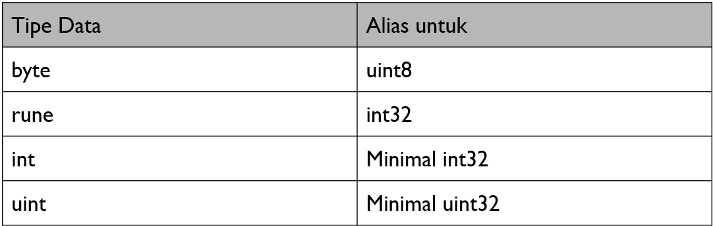

# Jenis-Jenis Tipe Data Primitive

Jenis-jenis tipe data yang terdapat dalam Go-Lang:

1. Integer: tipe data yang digunakan untuk menyimpan bilangan bulat seperti int dan uint. Tipe data ini memiliki ukuran yang berbeda, misalnya int8, int16, int32, int64, uint8, uint16, uint32, uint64.
2. Floating-point: tipe data yang digunakan untuk menyimpan bilangan desimal seperti float32 dan float64.
3. Boolean: tipe data yang digunakan untuk menyimpan nilai benar atau salah (true atau false).
4. String: tipe data yang digunakan untuk menyimpan urutan karakter atau teks.

### Tipe Data Alias

Tipe data alias adalah pemberian nama lain pada tipe data yang sudah ada sebelumnya.

<figure><figcaption>
Tipe data alias
</figcaption></figure>
